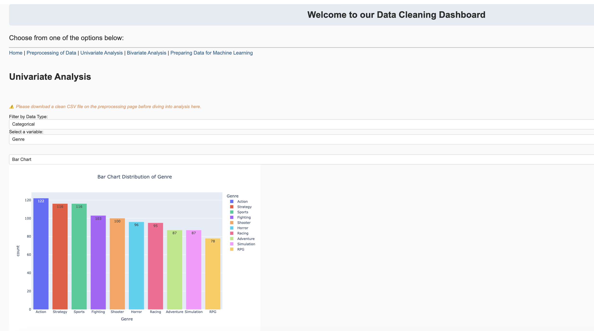
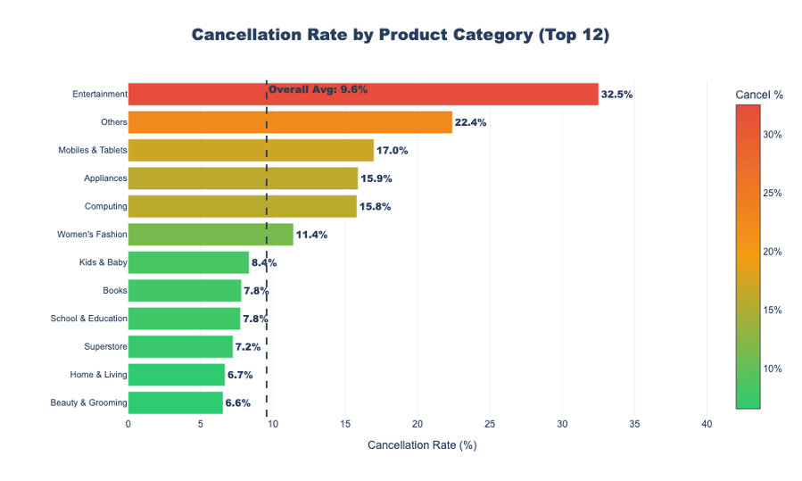
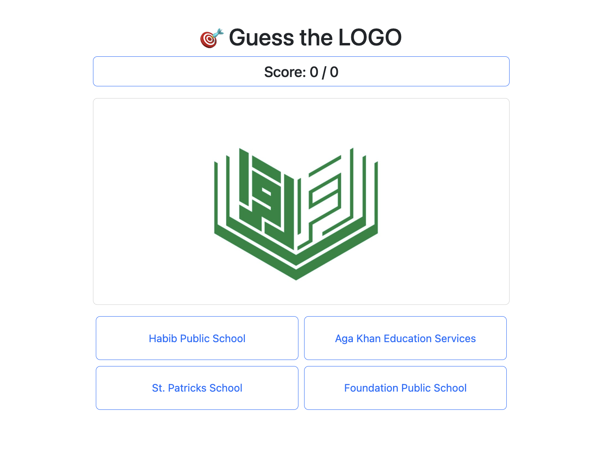

# Sadiq Bata – Data Science Portfolio

## 👋 About Me

I build data-driven tools and analyze real-world datasets to generate actionable insights.

I am a Data Science graduate student at IBA with a focus on building practical analytics tools, analyzing real-world datasets, and translating insights into decision-driven outcomes.

I am particularly interested in:
- Dashboard development  
- Performance analytics  
- User engagement and behavior analysis  
- Turning data into clear, actionable insights  

---

## 📂 Projects

---

### 🔹 Data Analysis & Cleaning Web Application  
**Interactive tool for data preprocessing, exploration, and analysis**

#### 📌 Problem  
Working with raw datasets often requires multiple steps — cleaning, transforming, and exploring data before it becomes usable.

#### 🛠️ What I Built  
- Developed a web-based application using Dash and Plotly  
- Enabled users to upload datasets and perform:
  - Missing value handling  
  - Data type transformations  
  - Univariate and bivariate analysis  
- Created an end-to-end workflow from raw data to analysis-ready output  

#### 📊 Key Value  
- Simplifies data preparation for users  
- Makes data exploration accessible through visualizations  

#### 🔗 Links  
- 🌐 [Try Live App](https://datacleanerzbatsyandyousfi.pythonanywhere.com/)

---

### 🔹 E-commerce Cancellation Analysis (Pakistan COD Market)  
**Analyzing cancellation behavior to identify key risk drivers**

#### 📌 Problem  
High order cancellation rates in cash-on-delivery (COD) markets lead to operational inefficiencies and financial losses.

#### 🛠️ What I Did  
- Cleaned and processed **584K+ transaction records**  
- Built a working dataset of **213K+ orders**  
- Engineered features:
  - Pricing  
  - Discounts  
  - Customer behavior  
  - Time-based patterns  
- Performed exploratory data analysis to identify trends  

#### 📊 Key Insight  
**Higher-value orders showed significantly higher cancellation risk, with clear variation across product categories and discount strategies.**

#### 💡 Recommendations  
- Introduce confirmation steps for high-value orders  
- Adjust pricing and discount strategies for high-risk segments  

#### 🔗 Links  
- 💻 [View Project Repository](https://github.com/Batsy1857/ecommerce-cancellation-analysis/tree/main)

---

### 🔹 AKDN Learning Engagement Tool  
**Interactive web-based activity to improve student engagement**

#### 📌 Problem  
Students often struggle to stay engaged with traditional learning methods.

#### 🛠️ What I Built  
- Developed a web-based quiz/game  
- Students identify AKDN institution logos and receive real-time feedback  
- Designed for interactive and engaging learning  

#### 📊 Key Observation  
**Real-time feedback and interactivity significantly improved student engagement and participation.**

#### 💡 Takeaway  
- Data-driven experimentation can improve user engagement and learning outcomes  

#### 🔗 Links  
- 🌐 [Try Live Tool](https://akdn.pythonanywhere.com/)

---

## 🧠 How I Think About Data

I approach data science as a process of:
- Understanding behavior  
- Identifying meaningful patterns  
- Translating insights into decisions  

I focus on building workflows that make data usable and on communicating findings clearly to support action.

---

## 🛠️ Skills

**Technical:** Python, Power BI, SQL, Pandas, NumPy, Plotly, Dash, Excel, PostgreSQL  
**Analytics:** Data Cleaning, EDA, Feature Engineering, Reporting, Dashboard Development  
**Tools:** Jupyter Notebook, VS Code, GitHub, pgAdmin  

---

## 📫 Contact

- Email: sadiq.bata@gmail.com  
